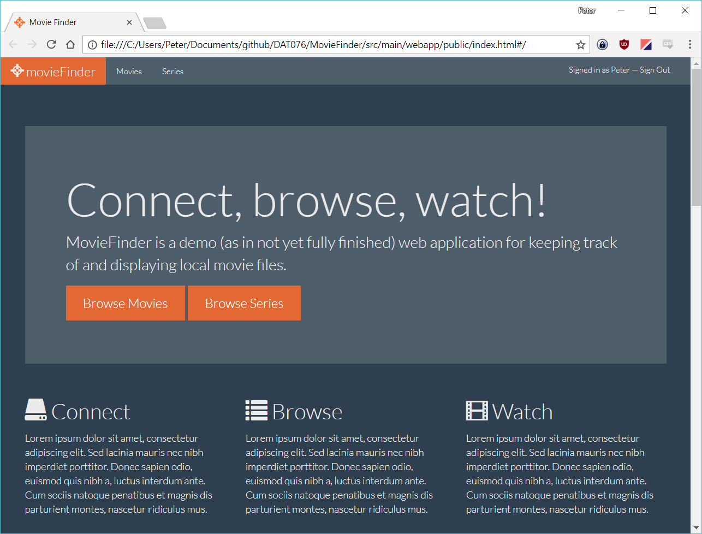

Movie Finder [](https://magnum.travis-ci.com/we4sz/DAT076)
============



MovieFinder is a demo (as in not yet fully finished) web application for keeping track of and displaying local movie files. The application is built as a Spring Framework REST API with an AngularJS based application as the frontend. 

The application was developed for the course [DAT076 (2014)](http://www.cse.chalmers.se/edu/year/2014/course/DAT076/) at Chalmers.

## Building MovieFinder
The application is built as a Maven project which should make building the application fairly easy.

### Step 0 - Download build dependencies
The build process requires a few tools to be already installed on the local machine and available on the PATH;
* [Maven](http://maven.apache.org/) - The build tool used for the project. Maven is often times included in IDEs, so might not be necessary to install.
* [NodeJS and npm](http://nodejs.org/) - Required to build the frontend of the application.
* [Git](http://git-scm.com/) - Used to download other dependencies.

### Step 1 - Clone the git repository
```
git clone https://github.com/we4sz/DAT076.git
```

### Step 2 - Set your database settings
The application requries a database to run. As to allow for different database setups the database settings are stored in a gitignored settings file.

Depending on what database setup you would like, choose one of the application.*.properites files in the `MovieFinder/src/main/resources/` directory and rename it to application.properties.

### Step 3 - Package the application using maven

```
cd MovieFinder
mvn package
```

*Note that this process might take several minutes the first time it is run, as a lot of third party dependencies has to be downloaded.*

This will produce a .war file in the MovieFinder/target directory. This file can be used to deploy the application on a java web server, such as [Apache Tomcat](http://tomcat.apache.org/).

## Running tests
The tests are also run using maven, as such the same dependencies as for the build process is required. Once those are installed, simply run the following in the MovieFinder directory.
```
mvn test
```

This will run both the backend and the frontend test suites.